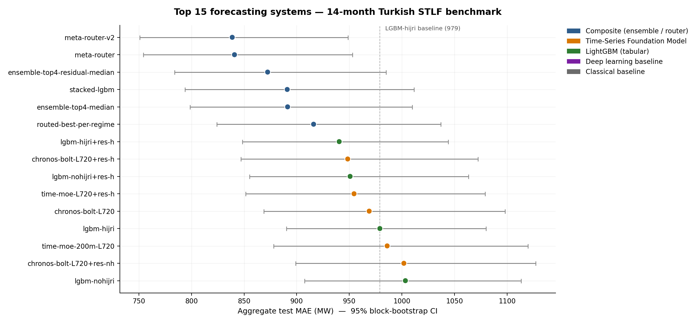
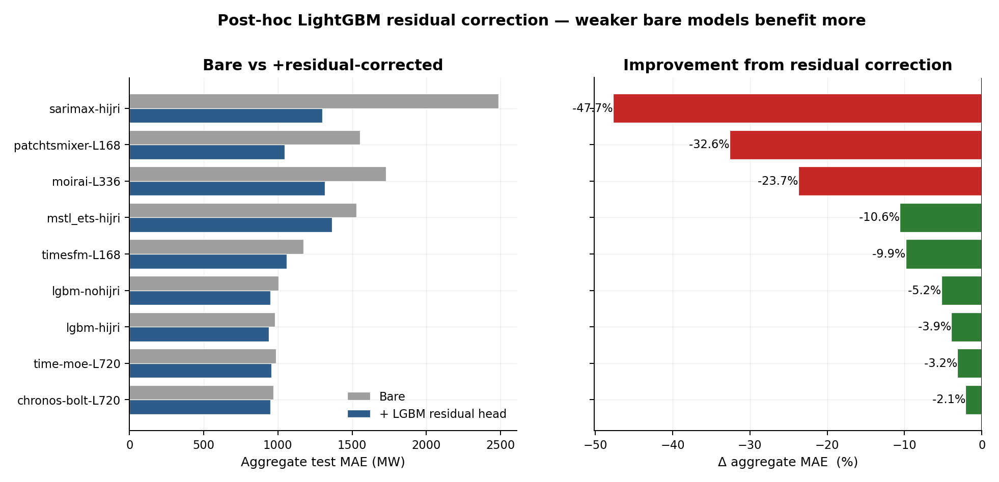
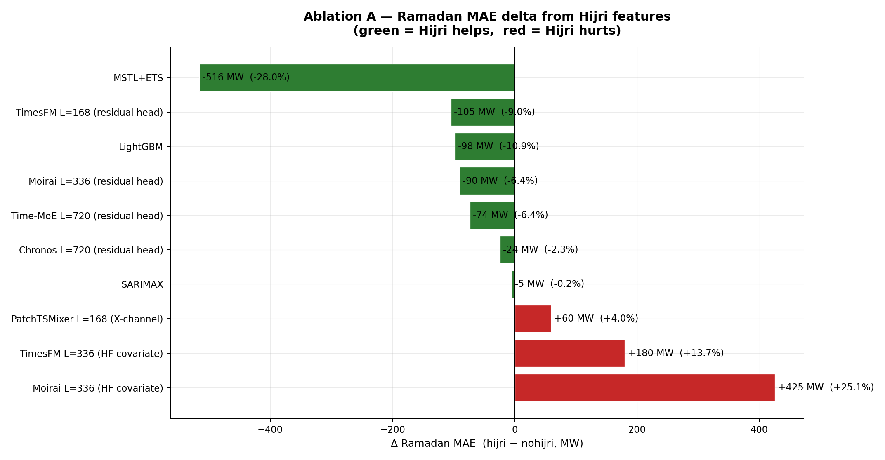
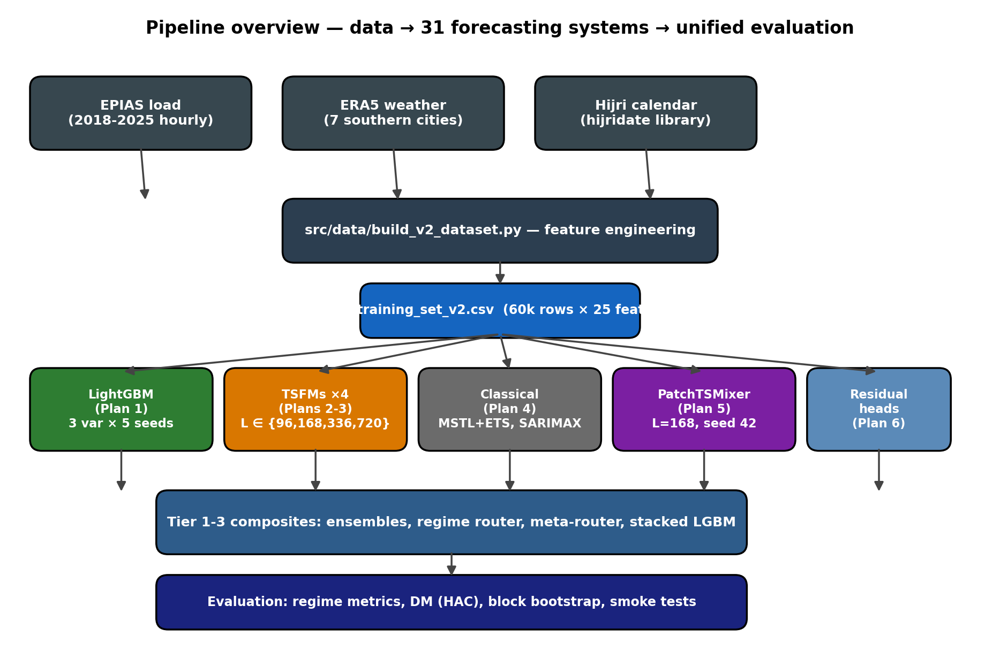

# Beyond Blackouts

### When time-series foundation models meet calendar-driven regime shifts, MENA-grid load prediction, and geographically tuned post-hoc residual correction


Egypt has spent the last two summers under rolling load-shedding schedules,
intermittent unscheduled blackouts, and proposed early-closing rules for
shops and restaurants — blunt demand-side instruments that distribute the
cost of forecast error across the entire commercial sector. Tighter
day-ahead forecasting, particularly one that understands how demand
reshapes around Ramadan, the two Eid holidays, and the heat-wave season,
is the precondition for replacing those blunt measures with finer-grained
market-based balancing. Because Egypt does not publish hourly load data at
sufficient resolution, we use the **Turkish national load series** — the
closest neighbour with comparable hot-Mediterranean weather, the same
Hijri-driven Ramadan and Eid consumption shifts, and an open transparency
platform — as a methodological proxy whose machinery transfers directly to
the Egyptian grid once comparable data is released.

On that proxy this repository delivers a rigorous **31-system benchmark**,
a **2.4 MB / 11-page LaTeX report**, a **14-slide React presentation** with
PDF export, and a 2:49 demo video — all derived from a single statistical
harness that pins every numeric claim with a 95 % stationary block-
bootstrap confidence interval and a Holm-adjusted Diebold–Mariano test.

---

## Headline result

The champion entry — **meta-router-v2** — combines four post-hoc-residual-
corrected models for Normal hours, the tuned LightGBM-hijri model for
Ramadan, and a 4-model Heat-wave ensemble of Chronos and Time-MoE.
Aggregate MAE on the 14-month test set is **838.8 MW (95 % CI [750.8,
948.7])** — **−13.4 %** over the strongest single bare model
(Chronos-Bolt-Base $L=720$ at 968.9) and **−14.3 %** over the tuned
LightGBM-hijri tabular incumbent (979.0).

<p align="center">
  
</p>

| Rank | System | Aggregate MAE (MW) | 95 % CI |
|-----:|--------|-------------------:|---------|
| 1 | **meta-router-v2** | **838.8** | [750.8, 948.7] |
| 2 | meta-router v1 | 840.9 | [754.5, 953.0] |
| 3 | ensemble of 4 (residual-corrected) | 872.4 | [783.9, 984.9] |
| 4 | stacked LightGBM meta-learner | 891.0 | [793.8, 1011.3] |
| 5 | ensemble of 4 (mixed) | 891.4 | [798.6, 1009.8] |
| 6 | routed best-per-regime | 916.0 | [824.2, 1036.9] |
| 7 | LightGBM-hijri + residual head | 940.4 | [848.5, 1044.1] |
| 8 | Chronos-Bolt L=720 + residual head | 948.5 | [846.9, 1072.4] |
| … | full 31-row table | — | — |

Full table + four pairwise Diebold–Mariano matrices (aggregate, Normal,
Ramadan, Heat-wave) in [`docs/statistical_appendix.md`](docs/statistical_appendix.md).

---

## Deliverables

| | Artifact | Open |
|---|---|---|
| 🎞️ | **Demo video** (2:49 animated walkthrough) | [v0.1-capstone-demo · presentation-demo.mp4](https://github.com/OmarTheGrey/Ramadan-Aware-Short-Term-Load-Forecasting-Benchmarking-/releases/download/v0.1-capstone-demo/presentation-demo.mp4) |
| 🖥️ | **Live deck** (static build, no install) | [`deck/index.html`](deck/index.html) |
| 🏛️ | **Reference landing page** | [`presentation.html`](presentation.html) |
| 📄 | **Compiled report** (11 pp, two-column) | [`Beyond-Blackouts-Report.pdf`](Beyond-Blackouts-Report.pdf) |
| ⚙️ | **Presentation source** (Vite + React + TS) | [`presentation/`](presentation/) |
| 📚 | **LaTeX source** | [`report/main.tex`](report/main.tex) |

<video src="https://github.com/OmarTheGrey/Ramadan-Aware-Short-Term-Load-Forecasting-Benchmarking-/releases/download/v0.1-capstone-demo/presentation-demo.mp4" controls width="100%"></video>

---

## Three findings

### 1 · The composite wins by pooling regime specialists

Different model families win different regimes — no single model wins all
three. The meta-router exploits this by routing each $\tau$ to the
specialist best-suited to its regime.

| Regime | Best single | Best composite | MAE (MW) |
|---|---|---|---:|
| Normal | LightGBM-hijri | ensemble-top4-residual | 775.1 |
| Ramadan | LightGBM-hijri | meta-router-v2 (routes to LGBM) | 799.9 |
| Heat-wave | Chronos-Bolt L=720 | meta-router-v2 (routes to Chronos) | 1206.0 |
| Compound | — (structurally empty 2018-2025) | — | — |

### 2 · A single residual head rescues every base model — monotonically

<p align="center">
  
</p>

A single post-hoc LightGBM residual head with **regime-stratified routing**
(train on Normal + Ramadan only; pass Heat-wave $\tau$ to the bare base)
improves all nine bases tested. The lift scales near-monotonically with
bare-model weakness:

| Base model | Bare MAE | Corrected | Δ |
|---|--------:|---------:|--------:|
| **SARIMAX-hijri** | 2485.9 | 1299.3 | **−47.7 %** |
| PatchTSMixer L=168 | 1552.7 | 1045.8 | −32.6 % |
| Moirai L=336 | 1727.1 | 1317.2 | −23.7 % |
| MSTL+ETS-hijri | 1527.5 | 1364.9 | −10.6 % |
| TimesFM L=168 | 1173.2 | 1057.5 | −9.9 % |
| LightGBM-nohijri | 1003.3 | 950.7 | −5.3 % |
| LightGBM-hijri | 979.0 | 940.4 | −4.0 % |
| Time-MoE L=720 | 985.9 | 954.5 | −3.2 % |
| Chronos-Bolt L=720 | 968.9 | 948.5 | −2.1 % |

Without the regime stratification, Normal-regime bias regresses Heat-wave
forecasts by 25–32 % on the strong TSFMs.

### 3 · Same Hijri features, opposite outcomes

<p align="center">
  
</p>

The same `is_ramadan` / `day_of_ramadan` / `is_eid` features produce
**opposite** Ramadan-MAE outcomes depending on how they enter the model:

- **HF in-band covariate API on TSFMs** → *hurts* TimesFM 14 %, Moirai 25 %
  (DM $p<0.001$)
- **Post-hoc LightGBM residual head on the same TSFMs** → *helps* the same
  models by 9–22 %
- **Feature engineering on tabular / classical models** → *helps* between
  7 % (LightGBM) and 28 % (MSTL+ETS)

The mechanism: HF's covariate API appends auxiliary channels into a
pretrained attention context that has no prior over them; they function
as distractors. A residual head bypasses that — it learns the calendar
effect on the residual signal and adds it as a separate stage the
foundation model never sees. **For zero-shot TSFMs, domain-specific
covariates belong as external corrections, not internal inputs.**

---

## Quick start

### Open the deliverables (no install)

```bash
# The static deck and the report PDF are pre-built at the repo root.
open deck/index.html              # macOS
start deck\index.html             # Windows
xdg-open deck/index.html          # Linux

open Beyond-Blackouts-Report.pdf
```

### Run the presentation from source

```bash
cd presentation
npm install
npm run dev                       # http://localhost:5173

# Launch directly into video-capture mode:
#   http://localhost:5173/?autoplay=1&clean=1

npm run build                     # production bundle in dist/
npm run export:pdf                # writes presentation.pdf (vector text, 14 pp)
```

### Reproduce the benchmark

```bash
# Python pipeline (~5 minutes for data, then ~8 h GPU + 5 h CPU for the
# full model grid; see docs/reproducibility.md for per-model commands)
pip install -e . && pip install -r requirements.txt
cp .env-example .env              # EPIAS credentials for the 2017 buffer

# Fetch the 40 ERA5 NetCDFs (~1.7 GB) from Copernicus CDS — see
# the header of the script for the one-time .cdsapirc setup.
pip install cdsapi
python scripts/download_era5.py

python -m src.data.preprocess_epias
python -m src.data.spatial_weights
python -m src.data.build_v2_dataset

pytest -q                         # 152 checks
```

### Rebuild the report

```bash
cd report
latexmk -pdf -bibtex main.tex     # → main.pdf (11 pp, two-column)
```

---

## Statistical contract

Every numeric claim in the report and the deck is pinned by:

| Apparatus | Implementation | Use |
|---|---|---|
| 95 % CI | Stationary block bootstrap (Politis & Romano 1994), mean block-length 24 h, 1 000 resamples | [`src/evaluation/bootstrap.py`](src/evaluation/bootstrap.py) |
| Diebold–Mariano | Newey-West HAC variance, truncation lag $h-1 = 23$ | [`src/evaluation/dm_test.py`](src/evaluation/dm_test.py) |
| Multiple comparison | Holm sequentially-rejective, $\alpha = 0.05$ | within each regime's pairwise family |
| Regime stratification | Normal / Ramadan / Heat-wave / Compound | [`src/evaluation/regime_eval.py`](src/evaluation/regime_eval.py) |
| Reproducibility | 152 pytest checks pin dataset, parquet schemas, statistical artefacts | [`tests/`](tests/) |

The complete 31×31 DM matrices for all four regimes live in
[`docs/statistical_appendix.md`](docs/statistical_appendix.md).

---

## What's in the box

- ✅ **Data pipeline** — EPIAS hourly load (2018-01 → 2025-03) joined with ERA5 weather (81 provinces, pop-weighted + southern-cities mean) and Umm al-Qura Hijri calendar features, with strict $t+24$-aware lag/rolling features
- ✅ **Five model families** — four TSFMs (Chronos-Bolt-Base, TimesFM 2.5, Moirai 1.1-R, Time-MoE-200M) at four context lengths each, two classical baselines (MSTL+ETS, SARIMAX), a 5-seed Optuna-tuned LightGBM, and a from-scratch PatchTSMixer deep baseline
- ✅ **Three controlled ablations** — Hijri-feature injection across model classes; the Compound (Ramadan × Heat-wave) regime documented as structurally empty for the 2018-2025 calendar; TSFM context-length sensitivity over $L \in \{96, 168, 336, 720\}$ · [context sweep](docs/tsfm_context_length_sweep.md) · [Hijri ablation](docs/tsfm_hijri_covariates.md)
- ✅ **Post-hoc residual heads** — a single LightGBM head with regime-stratified routing applied to nine base models · [docs](docs/residual_correction.md)
- ✅ **Three composite systems** — median ensemble, per-regime best-of router, Normal/Ramadan/Heat-wave meta-router v1 and v2 · [synthesis](docs/capstone_synthesis.md)
- ✅ **Statistical appendix** — 31-system bootstrap CIs and four pairwise Diebold–Mariano matrices (aggregate, Normal, Ramadan, Heat-wave), Holm-adjusted · [appendix](docs/statistical_appendix.md) · [deep analysis](docs/deep_analysis.md) · [failure modes](docs/failure_modes.md)
- ✅ **LaTeX report** — Egypt-anchored motivation, two-column layout, 11 pp · [`Beyond-Blackouts-Report.pdf`](Beyond-Blackouts-Report.pdf)
- ✅ **React presentation** — 14-slide Carbon-styled deck with live Recharts charts, framer-motion animations, video-capture mode, and a Playwright-driven PDF exporter · [`deck/index.html`](deck/index.html) / [`presentation/`](presentation/)

---

## Repository layout

```
.                            ← top-level deliverables
├── Beyond-Blackouts-Report.pdf     latest report render (11 pp, 2.4 MB)
├── presentation.html        landing page → deck / report / video / repo
├── deck/                    static built presentation (744 KB)
│
├── presentation/            React deck source (Vite + TS + Carbon)
│   ├── src/{components,charts,slides,reactbits}/
│   └── scripts/export-pdf.mjs
│
├── report/                  LaTeX source (main.tex + refs.bib)
│
├── src/                     Python pipeline
│   ├── data/                EPIAS + ERA5 preprocessing
│   ├── features/            hijri, calendar, weather_nonlinear, regimes
│   ├── models/              ml / classical / dl / tsfm / residual
│   └── evaluation/          metrics, DM, block bootstrap, regimes
│
├── data/
│   ├── raw/                 ERA5 NetCDFs (gitignored — fetch via scripts/download_era5.py)
│   ├── processed/           v2 dataset + weather panels
│   ├── predictions/         31 prediction parquets (per model × variant × L × seed)
│   ├── statistical_appendix/ CI table + 4 DM matrices
│   └── analysis/            horizon, diurnal, failure-mode CSVs
│
├── docs/                    8 result docs + reproduction manifest
│   ├── statistical_appendix.md    31-system CIs + 4 pairwise DM matrices
│   ├── capstone_synthesis.md      integrated cross-model narrative
│   ├── residual_correction.md     residual-head methodology + results
│   ├── deep_analysis.md           per-horizon + diurnal decomposition
│   ├── failure_modes.md           worst-day analysis
│   ├── reproducibility.md         end-to-end run instructions
│   └── superpowers/               design specs + implementation notes
│
├── tests/                   pytest mirror of src/ (152 checks)
└── scripts/                 CLI runners + analyzer / build scripts
```

---

## Pipeline overview

<p align="center">
  
</p>

Three data sources (EPIAS hourly load, ERA5 weather across 81 provinces,
Umm al-Qura Hijri calendar) feed a single $t+24$-aware **v2 feature
panel**. Five model families emit predictions to a uniform parquet schema,
which is composed by three families of composite systems and finally
evaluated by one statistical harness.

---

## Authors

| Name | Student ID |
|---|---:|
| Omar Shafiy | 23-201356 |
| Eiad Essam | 23-101108 |
| Omar Sharaf | 24-101236 |
| Shady Adham | 23-101027 |

**Supervisor**: Prof. Mohamed Taher Elrafaie
**Institution**: Egypt University of Informatics — Computing & Information Sciences
**Date**: May 2026

---

## Notes

The proposal's literal 35 °C heat-wave threshold doesn't fire on Turkey's
population-weighted national temperature (max ever ~36.1 °C, never three
consecutive days ≥ 35 °C). The v2 dataset uses an **unweighted mean of
seven southern-Turkish cities** (Adana, Şanlıurfa, Gaziantep, Diyarbakır,
Mersin, Konya, Antalya) as `temp_c_south` for heat-wave detection, while
keeping the pop-weighted `temp_c` for ML features. See
[`docs/v1_v2_lgbm_delta.md`](docs/v1_v2_lgbm_delta.md) for the leakage-fix
and dataset-migration history.

---

<sub>This repository, the compiled report, the presentation deck, and the demo video together constitute the capstone deliverable. Every numeric claim in any of them traces back to a parquet file on disk under <code>data/predictions/</code>, a CI in <code>data/statistical_appendix/ci_table.csv</code>, and a DM cell in one of the four <code>dm_*.csv</code> matrices. Built with Claude Code.</sub>
