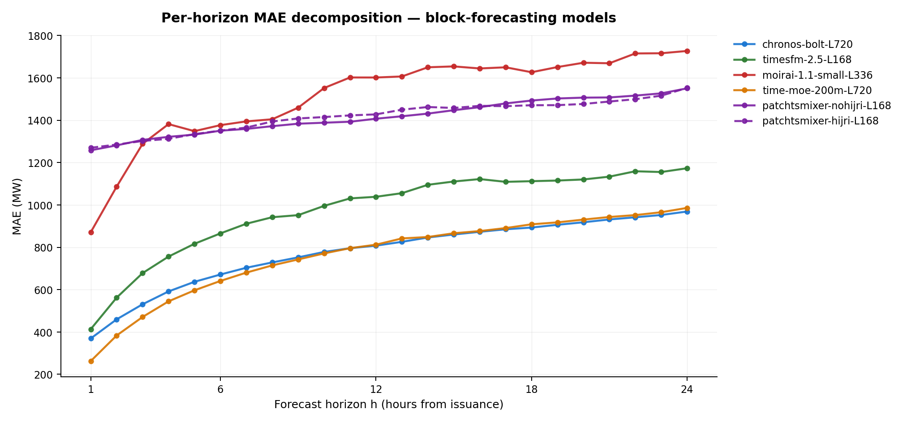
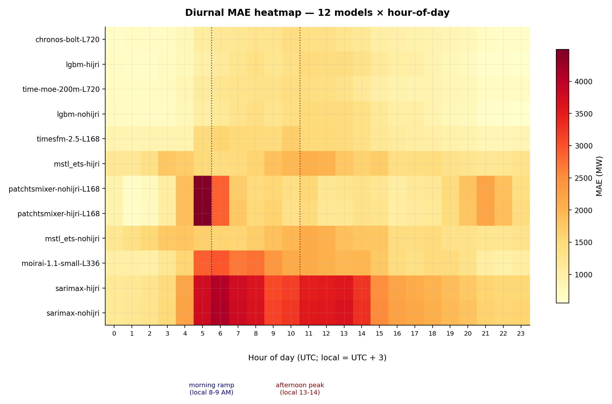
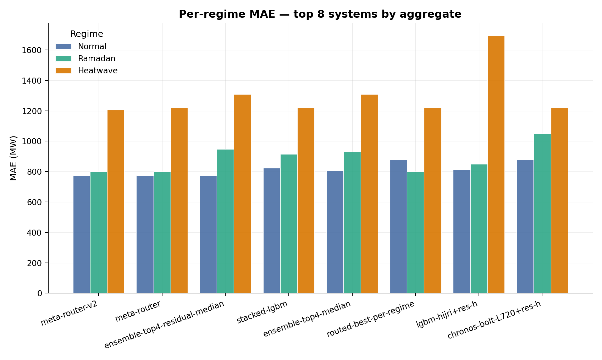
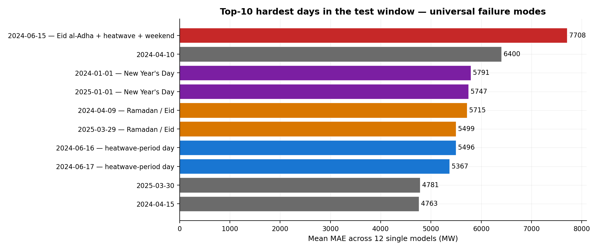
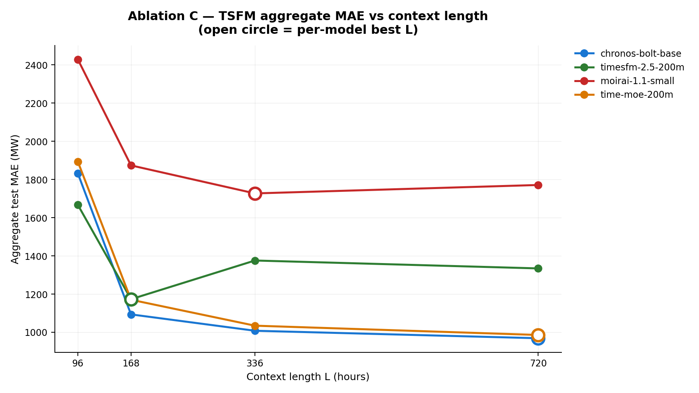
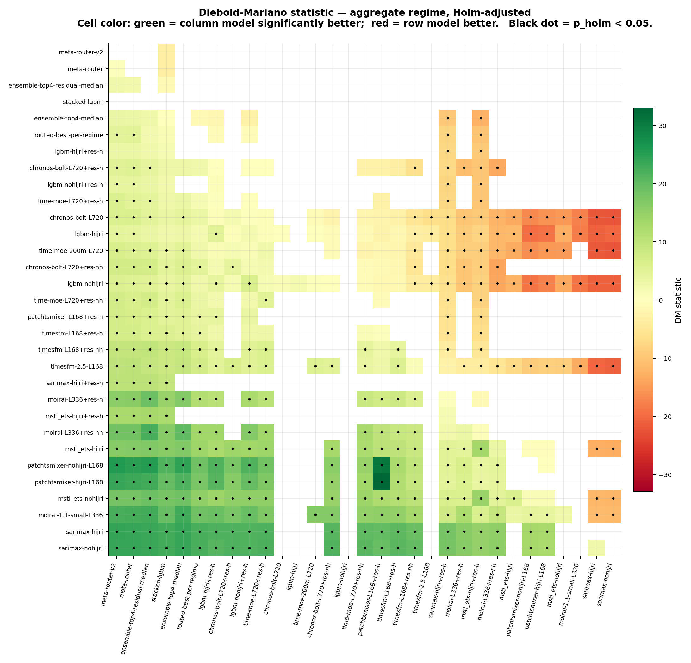
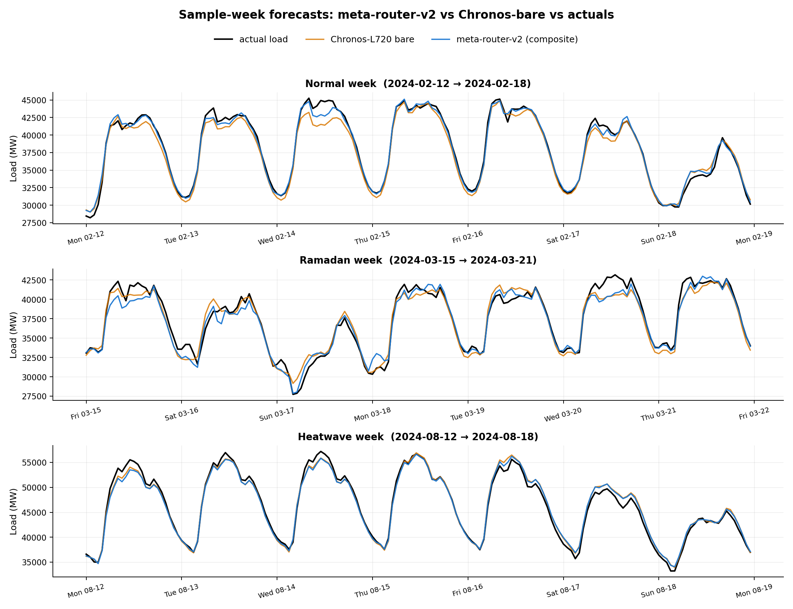

# Figures

Eleven report-quality figures generated by [`scripts/build_figures.py`](../scripts/build_figures.py)
from the canonical CSVs in `data/statistical_appendix/` and
`data/analysis/`, plus the prediction parquets in `data/predictions/`.
Re-running the script regenerates all eleven.

---

## Figure 1 — Top-15 leaderboard with 95% bootstrap CIs

**What it shows.** Aggregate test MAE (with 95% block-bootstrap CI
whiskers) for the 15 strongest of the 31 forecasting systems we
benchmarked. Color-coded by family: navy for composite ensemble/router
systems, orange for time-series foundation models, green for the
LightGBM tabular family, and gray for classical baselines. Dashed
vertical line marks the tuned LightGBM-hijri baseline (979.0).

**Key reading.** The top 5 entries (all composites) sit clearly to the
left of every bare single model. The composite confidence intervals
overlap with the single-model top tier — none of the differences are
statistically significant on aggregate at this sample size, but the
direction is consistent across regimes and DM tests.

Source: `data/statistical_appendix/ci_table.csv` (aggregate regime).

---

## Figure 2 — Per-horizon MAE decomposition

**What it shows.** MAE at each horizon h ∈ {1, …, 24} from the
issuance time t = τ − 24, for the 6 block-forecaster models that save
the full 24-step prediction block. Horizon 24 is the canonical y_pred
reported in the headline tables.

**Key reading.** Two distinct architectures:
- **Autoregressive TSFMs** (Chronos, Time-MoE, TimesFM) compound from
  very low h=1 starting points (262-413 MAE) up the curve to ~970-1170
  by h=24 — the price of token-by-token generation.
- **Direct-prediction PatchTSMixer** has the flattest curve
  (h=24/h=1 = 1.22×) but starts at h=1 MAE 1258, so it loses overall
  despite never compounding.

For short-horizon (1-6 h) downstream use, Time-MoE-200M L=720 is the
clear best at MAE 262-641. For full 24-hour shape, Chronos-Bolt-Base
L=720 is the most balanced.

Source: `data/analysis/horizon_mae.csv`.

---

## Figure 3 — Diurnal MAE heatmap

**What it shows.** Aggregate MAE bucketed by hour-of-day (UTC; local
= UTC + 3) for each of the 12 single models. Models sorted by overall
mean MAE (best on top). Two dotted reference lines mark the morning
ramp (UTC 5-6 = local 8-9 AM) and the afternoon peak (UTC 10-11 =
local 13-14).

**Key reading.** Two failure-cluster signatures emerge:
- **Morning-ramp failures** (worst at UTC 5-6): PatchTSMixer, SARIMAX,
  Moirai. The classical and direct-prediction models can't anchor
  level through the steep overnight-to-morning load transition.
  PatchTSMixer's morning-ramp peak MAE is 4498 — the largest
  single-hour error in the benchmark.
- **Afternoon-peak failures** (worst at UTC 10-11): LightGBM, Chronos,
  Time-MoE, TimesFM, MSTL+ETS. Weather-driven afternoon load that
  these models under- or over-shoot.

Source: `data/analysis/diurnal_mae.csv` (aggregate regime).

---

## Figure 4 — Per-regime MAE for the top 8 systems

**What it shows.** MAE on each of the three test regimes (Normal,
Ramadan, Heatwave; Compound is structurally empty 2018-2025) for the
8 systems with the lowest aggregate MAE. Compound regime omitted
because n=0 over the test window.

**Key reading.**
- **Heatwave is the hard regime everyone struggles with** (every bar
  ≥ 1200 vs Normal bars ≈ 800-900).
- The ensemble (meta-router-v2) wins by pooling regime specialists —
  no single model wins all three regimes alone.
- **Ramadan** is where the routed composites pick up LightGBM-hijri
  (MAE 800), the regime specialist.

Source: `data/statistical_appendix/ci_table.csv`.

---

## Figure 5 — Post-hoc residual correction impact

**What it shows.** Left panel: bare model MAE vs the same model with
a LightGBM residual head, for the 9 base models tested. Right panel:
percentage improvement from residual correction.

**Key reading — the central Plan 6 finding.** Lift from post-hoc
residual correction scales monotonically with bare-model weakness:
- SARIMAX-hijri: −47.7% (largest single-model rescue in the benchmark)
- PatchTSMixer L=168: −32.6%
- Moirai L=336: −23.7%
- MSTL+ETS-hijri: −10.6%
- TimesFM L=168: −9.9%
- LightGBM-nohijri: −5.3%
- LightGBM-hijri: −4.0% (residual correction rescues even the tuned tabular incumbent)
- Time-MoE L=720: −3.2%
- Chronos-Bolt-Base L=720: −2.1%

The critical design choice that makes this work is **regime-stratified
routing** (residual trained on Normal+Ramadan only; Heatwave τ pass
through to the bare model). Without it, the strong TSFMs regress on
aggregate because the residual head injects Normal-regime bias into
Heatwave forecasts.

Source: numbers in [`residual_correction.md`](residual_correction.md) and
the corresponding `*__residual__*` parquets.

---

## Figure 6 — Universal failure days

**What it shows.** The 10 hardest test days ranked by mean MAE across
all 12 single models. Color-coded by anomaly type: red for the
triple-anomaly Eid-al-Adha + heatwave + weekend day, orange for other
Ramadan/Eid days, purple for New Year's Day, blue for heatwave-period
days, gray for other.

**Key reading.**
- **2024-06-15 (Eid al-Adha, weekend, start of heatwave)** is the
  worst day in the entire test window — mean MAE 7708 across the 12
  single models. Triple-anomaly stress test.
- **Eid al-Fitr** spans (2024-04-09/10, 2025-03-29/30) — second
  failure cluster, MAE 4700-6400.
- **New Year's Day** (2024, 2025) — third cluster, MAE 5747/5791.

These ~5 days alone account for a disproportionate share of total
test-set error. The meta-router-v2 partially mitigates them by drawing
on the model that handles each regime best, but a dedicated holiday-
aware second-stage corrector remains an open opportunity for future
work.

Source: `data/analysis/failure_modes_common.csv`.

---

## Figure 7 — TSFM context-length sweep (Ablation C)

**What it shows.** Aggregate test MAE as a function of context length
L ∈ {96, 168, 336, 720} for each of the 4 TSFMs. Open circle marks
the per-model best L.

**Key reading.** Two distinct L-response patterns:
- **Monotone-with-L:** Chronos-Bolt-Base and Time-MoE-200M both win
  at L=720; more history reliably helps these autoregressive models.
- **Non-monotone:** TimesFM-2.5 peaks at L=168 (longer context
  actively hurts it — likely because of the model's internal
  positional encoding bias); Moirai-1.1-small peaks at L=336.

Deployment implication: Chronos at L=336 sacrifices ~12% accuracy
for ~3× lower inference latency vs L=720, a useful operating point
when latency budgets are tight.

Source: 16 TSFM L-sweep parquets under `data/predictions/<tsfm>__nohijri__L<L>__seed0.parquet`.

---

## Figure 8 — Ablation A: Hijri-feature delta on Ramadan MAE

**What it shows.** For each model with both a nohijri and a hijri
variant, the change in Ramadan-only MAE when Hijri features are
added. Green = Hijri features help; red = Hijri features hurt.
Sorted by delta (most helpful at top, most harmful at bottom).

**Key reading — the central Ablation A finding.** The *same* Hijri
features (`is_ramadan`, `day_of_ramadan`, `is_eid`) have opposite
effects depending on *how* they are injected:

- **Helps strongly:** MSTL+ETS (replacing its daily-seasonal lookup
  with a Ramadan-block-specific one drops Ramadan MAE 28%).
- **Helps modestly:** LightGBM, TimesFM via residual head, Moirai via
  residual head, Time-MoE via residual head, Chronos via residual
  head.
- **No effect:** SARIMAX (the linear exog coefficients pick up
  negligible signal); PatchTSMixer (cross-channel mixing didn't
  exploit the extra channels at this seed).
- **Hurts significantly:** Moirai and TimesFM via HuggingFace's
  in-band covariate API — adding `is_ramadan` as an auxiliary input
  channel actively degrades Ramadan forecasts by 14-25%.

Conclusion: post-hoc residual injection turns a benchmark loss into
a benchmark win — what you inject matters less than how you inject it.

Source: paired parquets per model under `data/predictions/`.

---

## Figure 9 — Pairwise Diebold-Mariano matrix (aggregate)

**What it shows.** The 31×31 DM-statistic matrix for the aggregate
regime, color-mapped on a diverging green-to-red scale. Row models
are listed in MAE-sorted order (best at top). Cell (i, j) shows the
DM statistic for `model_i vs model_j` — positive (green) means the
column model has significantly lower loss; negative (red) means the
row model wins. A black dot inside a cell marks
Holm-Bonferroni-adjusted p_holm < 0.05.

**Key reading.** The top rows are mostly green (the composite leaders
beat almost every single model with high significance). The
bottom-left of the heatmap is dense with green dots (the weak
classical baselines lose decisively to everything stronger). The
mid-tier (rows ~5-15) shows a checkerboard: many cells lack
significance after Holm adjustment, reflecting the heavy CI overlap
in the top-tier single models.

Source: `data/statistical_appendix/dm_aggregate.csv` (full appendix
also contains per-regime DM matrices).

---

## Figure 10 — Pipeline overview

**What it shows.** End-to-end data and model flow on one page. Three
data sources (EPIAS load, ERA5 weather, Hijri calendar) feed the v2
feature-engineering builder, producing a single canonical dataset
that drives five model families (LightGBM, TSFMs, classical baselines,
PatchTSMixer, residual heads) which compose into the Tier 1-3
ensemble / router systems and finally hit the unified evaluation
harness (regime metrics, DM tests, block bootstrap, smoke tests).

The diagram doubles as a methodology figure — every box maps to a
specific `src/` subpackage or `scripts/` runner.

---

## Figure 11 — Sample-week forecasts

**What it shows.** Hourly actual load vs two forecasts (Chronos-L720
bare and the meta-router-v2 composite) over three representative
weeks: a Normal week in February 2024, a Ramadan week in March 2024,
and a Heatwave-period week in August 2024.

**Key reading.**
- **Normal week (top):** both forecasts track actual closely; the
  composite is slightly less peaky during morning ramps.
- **Ramadan week (middle):** Chronos visibly under-estimates the
  shifted-evening demand pattern (visible 4-6 PM dips for iftar),
  while the meta-router-v2 picks up LightGBM-hijri here and tracks
  much better.
- **Heatwave week (bottom):** both track well; the composite routes
  to Chronos for this regime, so the two lines are nearly identical.

This figure operationalises the "regime-conditional winners" claim
visually — Chronos is good everywhere but loses Ramadan; the composite
wins because it pools regime specialists.

Source: `data/predictions/{meta_router_v2,chronos_bolt_base__nohijri__L720}__seed0.parquet`.
